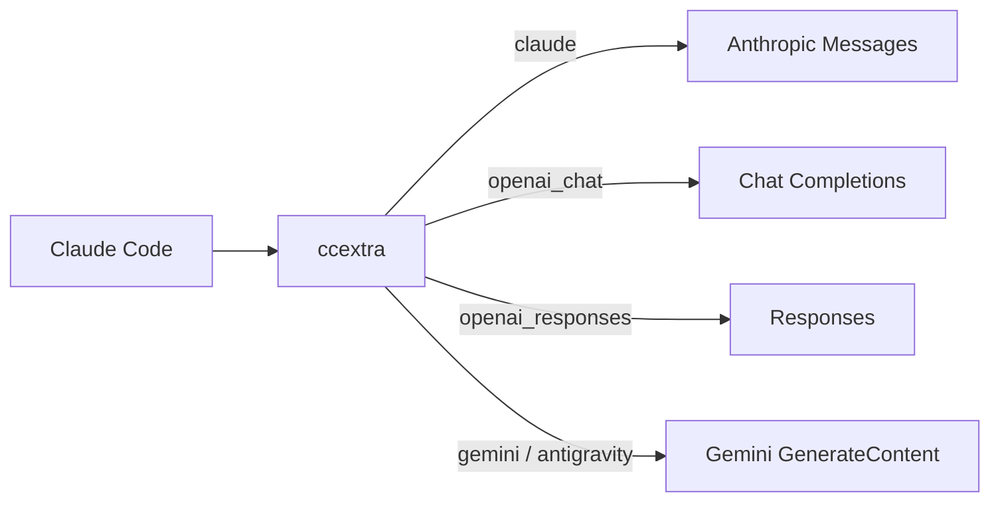

<div align="center">

# ccextra

<p align="center">
  <strong>The Intelligent Upstream Proxy for Claude Code.</strong><br>
  Multi-Protocol Routing · Deterministic Cache Normalization · Zero-Loss Passthrough
</p>

<p align="center">
  <a href="LICENSE"></a>
  <a href="Cargo.toml"></a>
  
</p>

<p align="center">
  <a href="README.md">中文</a> • <b>English</b>
</p>

<p align="center">
  <a href="#key-features">Key Features</a> •
  <a href="#architecture">Architecture</a> •
  <a href="#upstream-matrix">Upstream Matrix</a> •
  <a href="#quick-start">Quick Start</a> •
  <a href="#configuration">Configuration</a> •
  <a href="docs/design.md">Design Spec</a>
</p>

---

</div>

Single-process Rust proxy that seamlessly routes, converts, and relays Claude Code Anthropic Messages requests to multi-vendor upstreams.

## Key Features

- **Unified Multi-Protocol Hub**: Claude, OpenAI Chat, OpenAI Responses, Gemini, and Antigravity share a single ingress endpoint, dynamically routed by model alias.
- **Transparent Passthrough & Exact Adaptation**: `claude` routes swap only `model`; non-Claude models automatically strip billing attribution and Claude triggers, while clamping or pinning (`force_effort`) reasoning depth via `models.json`.
- **Deterministic Cache Optimization**: Locks down schema/tool order, historical reminders, parameter key ordering, and whitespace to eliminate cross-turn drift and maximize upstream Prompt Cache hit rates.
- **Dynamic Credentials Lifecycle**: Injects xAI Grok OAuth as Responses providers; quietly loads and refreshes Antigravity credentials on a background timer.
- **Zero-Downtime Hot Reload**: `POST /reload` updates providers, payload rules, authentication, proxies, and reasoning tables in milliseconds without process restart.

## Architecture



One process listens on one port. Input is always Anthropic-shaped; every path returns Anthropic responses (including SSE). See [architecture](docs/design.md).

## Upstream Matrix

| Protocol (`protocol`) | Upstream API Target | Core Adaptation Strategy |
| :--- | :--- | :--- |
| `claude` | Anthropic Messages | Minimal passthrough: swaps only `model`; sanitizes system prompts and clamps effort for non-Claude targets. |
| `openai_chat` | Chat Completions | Structural translation: converts messages, tools, images; supports Kimi K2.8 reasoning shapes and temperature guards. |
| `openai_responses` | Responses | Deep integration: converts to `instructions` and `input`; supports reasoning replay and domain filtering for web search. |
| `gemini` | Gemini GenerateContent | Native mapping: aligns content blocks, structured tools, and strict schema representations. |
| `antigravity` | Cloud Code Assist | Secure transport: wraps Gemini payloads in Cloud Code envelopes; supports optional high-performance connection pooling. |

> **Note**: xAI Grok is automatically injected as an `openai_responses` provider via OAuth without requiring a distinct protocol.

## Quick Start

### 1. Build & Run

```bash
# 1. Build release binary
cargo build --release

# 2. Copy and configure template
cp config.example.yaml config.yaml

# 3. Start the proxy
./target/release/ccextra --config config.yaml
```

### 2. Configuration Example (`config.yaml`)

```yaml
server:
  host: "127.0.0.1"
  port: 8222

providers:
  - name: upstream
    protocol: openai_responses
    base_url: https://example.com/v1
    key: sk-xxx
    prompt_cache_key: true
    models:
      - name: gpt-5.6-terra
        alias: gpt-5.6-terra

normalize:
  enabled: true
  drift_detector: true
```

### 3. Connect Claude Code

Configure environment variables in your terminal to route traffic:

```bash
export ANTHROPIC_BASE_URL=http://127.0.0.1:8222
export ANTHROPIC_AUTH_TOKEN=sk-ccextra-xxx  # required when secret_key is enabled
```

> **Background Management**: Use `build.sh` for fast compilation, paired with `start.sh`, `stop.sh`, and `restart.sh` for daemon control.

## Configuration

See [config.example.yaml](config.example.yaml) for every field. Key points:

- `models[].alias` is the inbound model name and cannot duplicate across providers; `base_url` accepts an ordered fallback array.
- Provider `proxy_url` overrides `server.proxy_url`; `"direct"` disables proxy use.
- `secret_key` enables ingress authentication: plaintext keys become bcrypt hashes on load and are written back; requests accept `x-api-key` or `Authorization: Bearer`.
- `payload` applies model-glob top-level overrides, optionally scoped by `protocol`.
- `prompt_cache_key` applies only to OpenAI paths, uses Claude Code session ID, and never replaces a nonempty key.
- `models_file` points at the reasoning-level table (default `models.json` next to the config; not tracked by git — copy [models.json.example](models.json.example) and edit as needed). Exact `id` match clamps inbound effort to the nearest supported level; missing file or unknown models leave effort unchanged. An entry may set `force_effort`: wherever clamping would apply, effort is rewritten to this fixed value (unclamped); native `*claude*` models and requests with thinking explicitly disabled are unaffected.

<details>
<summary>Advanced options</summary>

- `user_agents` overrides Claude, Codex, Grok, and Antigravity identifiers.
- `logging.request_body` writes diagnostic requests under `logs/`.
- `POST /reload` reloads providers, payload, normalization, auth, proxy, User-Agent, and the reasoning registry; restart for `logging.level` changes.
- `antigravity.connection-pool` controls the Antigravity upstream connection pool: short connections by default; with `enabled: true`, idle connections are kept per `idle-conn-timeout` (default 30s, capped at 210s) and `max-idle-conns-per-host` (default 2, capped at 100).
- Edits to `models.json` take effect after `POST /reload`; no rebuild needed.

</details>

## API Endpoints

| Method & Endpoint | Auth Required* | Description |
| :--- | :--- | :--- |
| `POST /v1/messages` | Required* | Primary messaging entrypoint; fully aligns with Anthropic protocols and SSE streaming. |
| `POST /v1/messages/count_tokens` | Required* | Exact or session-cached token counting (exact for Claude; cached counts for other protocols). |
| `GET /v1/models` | Required* | Retrieves available models formatted in Anthropic JSON shape. |
| `GET /health` | Public | Liveness probe returning `ok`. |
| `POST /reload` | Public | Zero-downtime hot reload for configurations, routes, and reasoning tables. |

> `*` Note: When `secret_key` is set, endpoints marked with `*` require `x-api-key` or `Authorization: Bearer`.

## Runtime Pipeline

Inbound requests execute sequentially: **Auth Verification ➔ Smart Routing ➔ Cache Normalization ➔ Protocol Translation ➔ Payload Overrides ➔ Prompt Cache Key Injection ➔ Upstream Relay & Backoff**.

- **SSE Stream Integrity**: Emits compliant Anthropic SSE events on all streaming paths with an automatic 10-second heartbeat (`: keepalive`).
- **Resilient Retry Budget**: Retries transient network failures, 429, and 5xx/52x errors with exponential backoff across a 3-second budget while cycling fallback URLs.
- **Header Fidelity**: Claude passthrough preserves original ingress identity headers and `anthropic-beta` without unsolicited additions.

## OAuth and operations

```bash
./ccextra antigravity-login
./ccextra antigravity-status
./ccextra xai-login
./ccextra xai-status
./scripts/check_antigravity_quota.sh
./scripts/check_grok_quota.sh
```

Antigravity credentials default to `.cache/antigravity` beside the config file; xAI defaults to `.cache/xai`. xAI loads at startup. Antigravity loads in background and refreshes models every three hours. Call `POST /reload` after config edits.

## Development & Architecture

```bash
# Run full test suite
cargo test --workspace

# Strict clippy lints
cargo clippy --workspace --all-targets -- -D warnings
```

Decoupled three-tier architecture:
- `ccextra-cli`: CLI interface, daemon lifecycle, and configuration loading.
- `ccextra-server`: HTTP layer, OAuth handlers, SSE state machines, and connection pools.
- `ccextra-core`: Pure IO-free core logic (routing algorithms, normalization, protocol converters, reasoning registry).

For detailed specifications, see [Architecture (design.md)](docs/design.md) and [Glossary (glossary.md)](docs/glossary.md).

## License

[MIT](LICENSE)
