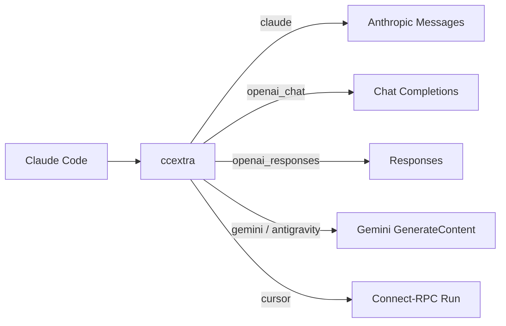

<div align="center">

# ccextra

<p align="center">
  <strong>Use models from different providers in Claude Code.</strong><br>
  One local endpoint for Claude, OpenAI, Gemini, and OAuth providers.
</p>

<p align="center">
  <a href="LICENSE"></a>
  <a href="Cargo.toml"></a>
  
</p>

<p align="center">
  <a href="README.md">中文</a> • <b>English</b>
</p>

<p align="center">
  <a href="#key-features">Key Features</a> •
  <a href="#architecture">Architecture</a> •
  <a href="#upstream-matrix">Upstream Matrix</a> •
  <a href="#quick-start">Quick Start</a> •
  <a href="#configuration">Configuration</a> •
  <a href="docs/design.md">Design Spec</a>
</p>

---

</div>

A single-process Rust proxy. Claude Code sends Anthropic Messages requests; ccextra selects an upstream by model alias, translates the request, and returns Anthropic-format JSON or SSE responses.

## Key Features

- **Route by model**: Claude, OpenAI, Gemini, Antigravity, and Cursor share one endpoint. Client-facing aliases remain separate from upstream model names.
- **Stable request content**: Normalize tools, schemas, and history to reduce incidental changes between turns. Actual cache hits depend on the upstream.
- **Model adaptation**: Translate messages, tool calls, and images; adjust supported reasoning levels through `models.json`.
- **OAuth providers**: Load and refresh Antigravity, xAI Grok, Codex (OpenAI ChatGPT subscription), and Cursor credentials with dynamic model routing. Cursor uses a separate Connect-RPC Run path.
- **Hot reload**: Publish configuration without restarting. In-flight requests keep their original snapshot.

## Architecture



One process listens on one port. Input is always Anthropic-shaped; every path returns Anthropic responses (including SSE). See [architecture](docs/design.md).

## Upstream Matrix

| Protocol (`protocol`) | Upstream API Target | Core Adaptation Strategy |
| :--- | :--- | :--- |
| `claude` | Anthropic Messages | Replace the target model; also sanitize system content and adjust effort for non-Claude models. Response bodies pass through. |
| `openai_chat` | Chat Completions | Translate messages, tools, and images; adapt Kimi K2.8 thinking parameters and temperature constraints. |
| `openai_responses` | Responses | Map `instructions` and `input`; support reasoning replay and search domain filtering. |
| `gemini` | Gemini GenerateContent | Translate content blocks, tool results, and schemas. |
| `antigravity` | Cloud Code Assist | Wrap Gemini requests, adapt tool names and output limits; use short connections by default. |
| `cursor` | Cursor AgentService/Run Connect-RPC | Single-credential OAuth, dynamic model catalog, bidirectional H2, Anthropic JSON/SSE mapping, and MCP continuation with a stable session. Live upstream compatibility remains unverified. |

> **Note**: xAI Grok and Codex are automatically injected as `openai_responses` providers via OAuth without requiring a distinct protocol. Codex subscription requests carry the `Chatgpt-Account-Id` identity header automatically, and request bodies are zstd-compressed (matching codex CLI defaults).

## Quick Start

### 1. Build

```bash
cargo build --release
```

### 2. Configure an upstream

Copy and edit the [configuration template](config.example.yaml), or save the minimal example below as `config.yaml`. Replace `base_url`, `key`, and `models[].name` with values supported by your upstream.

```yaml
server:
  host: "127.0.0.1"
  port: 8222

providers:
  - name: upstream
    protocol: openai_responses
    base_url: https://example.com/v1
    key: sk-xxx
    prompt_cache_key: true
    models:
      - name: your-upstream-model
        alias: coding

normalize:
  enabled: true
  drift_detector: true

logging:
  level: info
  request_body: false

secret_key: "replace-with-your-local-key"
```

For OpenAI protocols, include the version prefix (such as `/v1`) in `base_url`, but not `/responses` or `/chat/completions`. For the Claude protocol, omit `/v1`.

### 3. Start and connect

Start the proxy:

```bash
./target/release/ccextra --config config.yaml
```

In another terminal, use the local key from your configuration. This key is separate from the upstream `providers[].key`:

```bash
export ANTHROPIC_BASE_URL=http://127.0.0.1:8222
export ANTHROPIC_AUTH_TOKEN=replace-with-your-local-key
claude --model coding
```

On first load, `secret_key` is hashed with bcrypt and written back to the config. Clients continue to use the original plaintext key.

Check the service and available models:

```bash
curl http://127.0.0.1:8222/health
curl -H "Authorization: Bearer $ANTHROPIC_AUTH_TOKEN" \
  http://127.0.0.1:8222/v1/models
```

For background operation, use `build.sh` with `start.sh`, `stop.sh`, and `restart.sh`. These scripts use the root-level `./ccextra` binary, which `build.sh` updates.

## Configuration

See [config.example.yaml](config.example.yaml) for every field. Key points:

- `models[].alias` is the inbound model name and cannot duplicate across providers; `base_url` accepts an ordered fallback array.
- Provider `proxy_url` overrides `server.proxy_url`; `"direct"` disables proxy use.
- `secret_key` enables ingress authentication: plaintext keys become bcrypt hashes on load and are written back; requests accept `x-api-key` or `Authorization: Bearer`.
- `payload` applies model-glob top-level overrides, optionally scoped by `protocol`.
- `prompt_cache_key` applies only to OpenAI paths, uses Claude Code session ID, and never replaces a nonempty key.
- `models_file` points at the reasoning-level table (default `models.json` next to the config; not tracked by git — copy [models.json.example](models.json.example) and edit as needed). Exact `id` match clamps inbound effort to the nearest supported level; missing file or unknown models leave effort unchanged. An entry may set `force_effort`: wherever clamping would apply, effort is rewritten to this fixed value (unclamped); native `*claude*` models and requests with thinking explicitly disabled are unaffected. Cursor's dynamic catalog does not use `models_file`.
- `cursor_auth_dir` defaults to `.cache/cursor` next to the config. `cursor_base_url` defaults to `https://api2.cursor.sh`; `cursor_client_version` defaults to `cli-2026.02.13-41ac335`. `cursor_default_model` specifies an advertised fallback only if the catalog does not advertise `auto`. Set these at the top level, not in `providers`; no static Cursor provider is needed.

<details>
<summary>Advanced options</summary>

- `user_agents` overrides Claude, Codex, Grok, and Antigravity identifiers.
- `logging.request_body` writes diagnostic requests under `logs/`.
- `POST /reload` validates and atomically publishes providers, payload, normalization, auth, proxy, User-Agent, the reasoning registry, and background refresh settings. Existing requests keep their snapshot; new requests use the new snapshot. Concurrent reloads serialize loading and publication; load or validation failures leave the snapshot and version unchanged. Restart for `logging.level` changes.
- Background refresh uses the last successfully published static configuration, credential directories, and proxy, without reading config file edits awaiting reload. Stale refresh results are discarded; an empty Antigravity result preserves the entire provider set. Explicit reload applies removals, disabled credentials, and directory changes without restoring old dynamic providers; dynamic loaders retain their existing behavior of skipping unavailable credentials.
- `antigravity.connection-pool` controls the Antigravity upstream connection pool: short connections by default; with `enabled: true`, idle connections are kept per `idle-conn-timeout` (default 30s, capped at 210s) and `max-idle-conns-per-host` (default 2, capped at 100).
- Edits to `models.json` take effect after `POST /reload`; no rebuild needed.

</details>

## API Endpoints

| Method & Endpoint | Auth Required* | Description |
| :--- | :--- | :--- |
| `POST /v1/messages` | Required* | Accept Anthropic Messages and return JSON or SSE. |
| `POST /v1/messages/count_tokens` | Required* | Forward Claude counting upstream; use session records for other protocols, returning 0 on a miss. |
| `GET /v1/models` | Required* | List available models in Anthropic format. |
| `GET /health` | Public | Return `ok`; does not check upstream availability. |
| `POST /reload` | Public | Load, validate, and publish configuration without restarting. |

> `*` Note: When `secret_key` is set, endpoints marked with `*` require `x-api-key` or `Authorization: Bearer`.

## Runtime Pipeline

<details>
<summary>Request processing, retries, and resource limits</summary>

Requests pass through authentication, model routing, normalization, protocol conversion, and parameter overrides before reaching the upstream. OpenAI paths can inject `prompt_cache_key`; Gemini and Antigravity skip OpenAI-specific processing.

- **Request compatibility**: OpenAI Chat/Responses conversions remove `required: null` from tool schemas without changing instance data such as `default`; Antigravity neutralizes leading Claude Agent SDK/Claude Code identity sentences in system blocks while keeping later instructions. Native Claude passthrough is unchanged.
- **Streaming**: Claude response bytes pass through; other protocols are converted to Anthropic SSE. All streaming paths use a 10-second `: keepalive`.
- **Retries & fallbacks**: 429/5xx (including 52x) and network errors rotate through multiple `base_url` entries within the same round; once exhausted, the last upstream error fails fast back to the client. Backoff and retries belong to the client (e.g. Claude Code); the upstream `Retry-After` header passes through. The streaming first-frame preload skips `: keepalive` comment frames; a first-frame error triggers one internal retry, and a second failure returns 502 instead of committing 200. Normal generation is never truncated.
- **Read limits**: Non-stream success bodies are capped at 16 MiB, error bodies retain at most 256 KiB, and read idle is 180 seconds. Oversized success bodies return 502; stalls return 504. Error-body read failures retain the known status for normal error mapping. OAuth, project, and model reads retain their 30-second total timeout.
- **Headers**: Claude forwards permitted identity headers while excluding authentication and connection-management headers. `anthropic-beta` passes through unchanged and is not added when absent.

</details>

## OAuth and operations

Log in to an upstream or inspect saved credential status:

```bash
./ccextra antigravity-login
./ccextra antigravity-status
./ccextra xai-login
./ccextra xai-status
./ccextra codex-login
./ccextra codex-status
./ccextra cursor-login
./ccextra cursor-status
./scripts/check_antigravity_quota.sh
./scripts/check_grok_quota.sh
./scripts/check_codex_quota.sh
```

Antigravity credentials default to `.cache/antigravity` next to the config; xAI uses `.cache/xai`, Codex `.cache/codex`, and Cursor `.cache/cursor`. xAI, Codex, and Cursor are discovered at startup; Cursor publishes models only after `GetUsableModels` succeeds. On a failed `/reload` discovery, it keeps the prior catalog only if the credential directory and account are unchanged; aliases from new static providers take priority. Background refresh failures keep the published catalog. Antigravity loads in the background and refreshes models every three hours. Codex login uses PKCE browser authorization (local callback port defaults to 1455, override with `--callback-port`); tokens refresh 24 hours ahead of expiry.

Cursor login uses its own PKCE browser flow and polling; neither the Cursor IDE nor `cursor-agent` is required. Use `--no-browser` to open the login URL manually. Cursor tokens refresh 10 minutes ahead of expiry. Run uses a separate bidirectional HTTP/2 Connect-RPC path and maps text, thinking, and tool calls to Anthropic JSON/SSE. Local tests exist, but the implementation has not been validated against a live Cursor upstream; do not treat it as production-ready. Proxying a Cursor subscription may violate its terms of service and put the account at risk of suspension.

With a stable Claude session ID, an MCP tool call keeps the upstream stream open; the next request matches text `tool_result` blocks by `tool_use_id`. All pending tool calls must have matching results. Idle streams expire after five minutes; raw checkpoints are bound to the credential and retained for 30 minutes. Without a stable session, or after the upstream stream expires, the full history and tool results are flattened into a new Run request. Image inputs, built-in exec tool execution, and Cursor CLI passthrough are unsupported; built-in tool requests receive a rejection.

Cursor supports one credential. Run request DATA remains open; only a Connect JSON trailer with flags `0x02` ends the response, while premature EOF is an error. A 401 triggers one credential refresh and retry only before output; 429 is never retried. Server and transport errors back off within a three-second budget. Error responses forward `Retry-After` when supplied by the upstream.

After editing configuration, or to reload credentials immediately:

```bash
curl -X POST http://127.0.0.1:8222/reload
```

Configuration load or validation failures preserve the previous configuration. See “Advanced options” above for refresh and removal rules.

## Development & Architecture

```bash
# Run full test suite
cargo test --workspace

# Strict clippy lints
cargo clippy --workspace --all-targets -- -D warnings
```

Decoupled three-tier architecture:
- `ccextra-cli`: CLI interface, daemon lifecycle, and configuration loading.
- `ccextra-server`: HTTP layer, OAuth handlers, SSE state machines, and connection pools.
- `ccextra-core`: Pure IO-free core logic (routing algorithms, normalization, protocol converters, reasoning registry).

For detailed specifications, see [Architecture (design.md)](docs/design.md) and [Glossary (glossary.md)](docs/glossary.md).

## License

[MIT](LICENSE)
