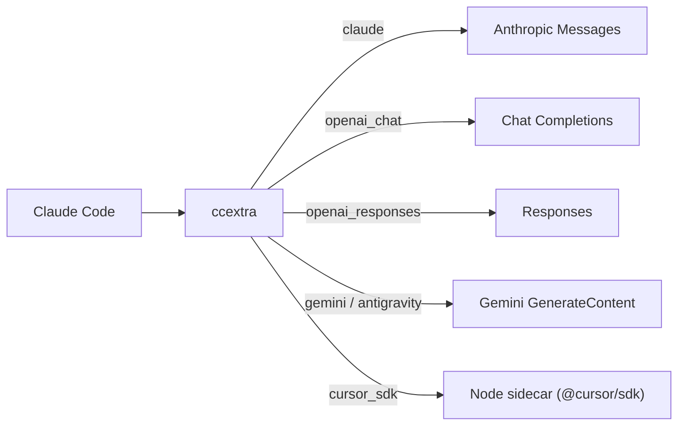

<div align="center">

# ccextra

<p align="center">
  <strong>Use models from different providers in Claude Code.</strong><br>
  One local endpoint for Claude, OpenAI, Gemini, and OAuth providers.
</p>

<p align="center">
  <a href="LICENSE"></a>
  <a href="Cargo.toml"></a>
  
</p>

<p align="center">
  <a href="README.md">中文</a> • <b>English</b>
</p>

<p align="center">
  <a href="#key-features">Key Features</a> •
  <a href="#architecture">Architecture</a> •
  <a href="#upstream-matrix">Upstream Matrix</a> •
  <a href="#quick-start">Quick Start</a> •
  <a href="#configuration">Configuration</a> •
  <a href="docs/design.md">Design Spec</a>
</p>

---

</div>

A single-process Rust proxy. Claude Code sends Anthropic Messages requests; ccextra selects an upstream by model alias, translates the request, and returns Anthropic-format JSON or SSE responses.

## Key Features

- **Route by model**: Claude, OpenAI, Gemini, and Antigravity share one endpoint. Client-facing aliases remain separate from upstream model names.
- **Stable request content**: Normalize tools, schemas, and history to reduce incidental changes between turns. Actual cache hits depend on the upstream.
- **Model adaptation**: Translate messages, tool calls, and images; adjust supported reasoning levels through `models.json`.
- **OAuth providers**: Load and refresh Antigravity, xAI Grok, Codex (OpenAI ChatGPT subscription), and Cursor (Agent SDK sidecar) credentials with dynamic model routing.
- **Hot reload**: Publish configuration without restarting. In-flight requests keep their original snapshot.

## Architecture


```mermaid
flowchart LR
    CC["Claude Code"] --> P["ccextra"]
    P -->|claude| A["Anthropic Messages"]
    P -->|openai_chat| B["Chat Completions"]
    P -->|openai_responses| C["Responses"]
    P -->|gemini / antigravity| D["Gemini GenerateContent"]
    P -->|cursor_sdk| E["Node sidecar (@cursor/sdk)"]
```

One process listens on one port. Input is always Anthropic-shaped; every path returns Anthropic responses (including SSE). See [architecture](docs/design.md).

## Upstream Matrix

| Protocol (`protocol`) | Upstream API Target | Core Adaptation Strategy |
| :--- | :--- | :--- |
| `claude` | Anthropic Messages | Replace the target model; also sanitize system content and adjust effort for non-Claude models. Response bodies pass through. |
| `openai_chat` | Chat Completions | Translate messages, tools, and images; adapt Kimi K2.8 thinking parameters and temperature constraints. |
| `openai_responses` | Responses | Map `instructions` and `input`; support reasoning replay and search domain filtering. |
| `gemini` | Gemini GenerateContent | Translate content blocks, tool results, and schemas. |
| `antigravity` | Cloud Code Assist | Wrap Gemini requests, adapt tool names and output limits; use short connections by default. |
| `cursor_sdk` | Cursor Agent SDK | Call `@cursor/sdk` through a local Node sidecar; auto-discover the model catalog and resume sessions. |

> **Note**: xAI Grok and Codex are automatically injected as `openai_responses` providers via OAuth without requiring a distinct protocol. Codex subscription requests carry the `Chatgpt-Account-Id` identity header automatically, and request bodies are zstd-compressed (matching codex CLI defaults). Cursor is likewise synthesized into a `cursor_sdk` provider (fixed name `cursor`) from the `cursor_auth_dir` credential — no manual provider entry required.

## Quick Start

### 1. Build

```bash
cargo build --release
```

Enabling the Cursor SDK sidecar requires extra prerequisites: Node >= 24 and installed dependencies under `sidecar/cursor`. `build.sh` checks the Node version, runs `npm ci`, and verifies the `@cursor/sdk` version before building; a plain `cargo build` skips those steps, and a missing or unpopulated sidecar directory makes Cursor enablement fail at runtime (other protocols are unaffected).

### 2. Configure an upstream

Copy and edit the [configuration template](config.example.yaml), or save the minimal example below as `config.yaml`. Replace `base_url`, `key`, and `models[].name` with values supported by your upstream.

```yaml
server:
  host: "127.0.0.1"
  port: 8222

providers:
  - name: upstream
    protocol: openai_responses
    base_url: https://example.com/v1
    key: sk-xxx
    prompt_cache_key: true
    models:
      - name: your-upstream-model
        alias: coding

normalize:
  enabled: true
  drift_detector: true

logging:
  level: info
  request_body: false

secret_key: "replace-with-your-local-key"
```

For OpenAI protocols, include the version prefix (such as `/v1`) in `base_url`, but not `/responses` or `/chat/completions`. For the Claude protocol, omit `/v1`.

### 3. Start and connect

Start the proxy:

```bash
./target/release/ccextra --config config.yaml
```

In another terminal, use the local key from your configuration. This key is separate from the upstream `providers[].key`:

```bash
export ANTHROPIC_BASE_URL=http://127.0.0.1:8222
export ANTHROPIC_AUTH_TOKEN=replace-with-your-local-key
claude --model coding
```

On first load, `secret_key` is hashed with bcrypt and written back to the config. Clients continue to use the original plaintext key.

Check the service and available models:

```bash
curl http://127.0.0.1:8222/health
curl -H "Authorization: Bearer $ANTHROPIC_AUTH_TOKEN" \
  http://127.0.0.1:8222/v1/models
```

For background operation, use `build.sh` with `start.sh`, `stop.sh`, and `restart.sh`. These scripts use the root-level `./ccextra` binary, which `build.sh` updates.

## Configuration

See [config.example.yaml](config.example.yaml) for every field. Key points:

- `models[].alias` is the inbound model name and cannot duplicate across providers; `base_url` accepts an ordered fallback array.
- Provider `proxy_url` overrides `server.proxy_url`; `"direct"` disables proxy use.
- `secret_key` enables ingress authentication: plaintext keys become bcrypt hashes on load and are written back; requests accept `x-api-key` or `Authorization: Bearer`.
- `payload` applies model-glob top-level overrides, optionally scoped by `protocol`.
- `prompt_cache_key` applies only to OpenAI paths, uses Claude Code session ID, and never replaces a nonempty key.
- `models_file` points at the reasoning-level table (default `models.json` next to the config; not tracked by git — copy [models.json.example](models.json.example) and edit as needed). Exact `id` match clamps inbound effort to the nearest supported level; missing file or unknown models leave effort unchanged. An entry may set `force_effort`: wherever clamping would apply, effort is rewritten to this fixed value (unclamped); native `*claude*` models and requests with thinking explicitly disabled are unaffected.
- `antigravity_models` is a model allowlist (top-level, glob or exact names, e.g. `["claude-opus-5-5-*", "gpt-5.2"]`); absent or empty publishes the full catalog. Filtering happens at dynamic catalog load against upstream model names; an empty result makes Antigravity publish an empty model list for that credential. Applies to `/reload` and the three-hour background refresh.
- Cursor fields: `cursor_auth_dir` enables the SDK sidecar (credential directory, default `.cache/cursor` next to the config); `cursor_models` is an allowlist (glob or exact names, `default` is equivalent to `auto`, absent means full catalog), and entries may pin fixed parameters as `"id:param=value"` (e.g. `"auto-smart:optimize_for=intelligence"`; parameters must exist in the SDK catalog vocabulary, see `list_cursor_models.sh`); inbound `thinking`/effort maps to `modelParams` against that vocabulary — `thinking.type: enabled` maps to `thinking=true` (when the vocabulary has that parameter), effort prefers the models.json registry and falls back to body parsing, clamped to the nearest vocabulary level (`none` never clamps up; models without an effort parameter skip it); `cursor_sidecar_idle_secs` (default 1800) and `cursor_sidecar_max_agents` (default 16) control sidecar recycling and concurrency; `cursor_workspace_dir` sets the SDK working directory (defaults to the process cwd; supports `~` and paths relative to the config file). When enabled, a `cursor_sdk` provider named `cursor` is synthesized automatically; models whose alias conflicts with an existing provider are skipped with a warning (names may repeat across providers). Failed refreshes keep the last successful catalog. Cursor images support base64 PNG, JPEG, WebP, and GIF; remote image URLs return HTTP 400.

<details>
<summary>Advanced options</summary>

- `user_agents` overrides Claude, Codex, Grok, and Antigravity identifiers.
- `logging.request_body` writes diagnostic requests under `logs/`.
- `POST /reload` validates and atomically publishes providers, payload, normalization, auth, proxy, User-Agent, the reasoning registry, and background refresh settings. Existing requests keep their snapshot; new requests use the new snapshot. Concurrent reloads serialize loading and publication; load or validation failures leave the snapshot and version unchanged. Restart for `logging.level` changes.
- Background refresh uses the last successfully published static configuration, credential directories, and proxy, without reading config file edits awaiting reload. Stale refresh results are discarded; an empty Antigravity result preserves the entire provider set. Explicit reload applies removals, disabled credentials, and directory changes without restoring old dynamic providers; dynamic loaders retain their existing behavior of skipping unavailable credentials.
- `antigravity.connection-pool` controls the Antigravity upstream connection pool: short connections by default; with `enabled: true`, idle connections are kept per `idle-conn-timeout` (default 30s, capped at 210s) and `max-idle-conns-per-host` (default 2, capped at 100).
- Edits to `models.json` take effect after `POST /reload`; no rebuild needed.

</details>

## API Endpoints

| Method & Endpoint | Auth Required* | Description |
| :--- | :--- | :--- |
| `POST /v1/messages` | Required* | Accept Anthropic Messages and return JSON or SSE. |
| `POST /v1/messages/count_tokens` | Required* | Forward Claude counting upstream; use session records for other protocols, returning 0 on a miss. Real streaming input usage from Chat/Responses/Gemini/Antigravity also updates these records; missing or zero values preserve the previous value. |
| `GET /v1/models` | Required* | List available models in Anthropic format. |
| `GET /health` | Public | Return `ok`; does not check upstream availability. |
| `POST /reload` | Public | Load, validate, and publish configuration without restarting. |

> `*` Note: When `secret_key` is set, endpoints marked with `*` require `x-api-key` or `Authorization: Bearer`.

## Runtime Pipeline

<details>
<summary>Request processing, retries, and resource limits</summary>

Requests pass through authentication, model routing, normalization, protocol conversion, and parameter overrides before reaching the upstream. OpenAI paths can inject `prompt_cache_key`; Gemini and Antigravity skip OpenAI-specific processing.

- **Request compatibility**: OpenAI Chat/Responses conversions remove `required: null` from tool schemas without changing instance data such as `default`. Chat also converts schema-position `true` to `{}`, preserving `false` and boolean `additionalProperties`. Responses wire JSON starts with `model`, `stream`, and an existing `service_tier`; other fields and nested content remain unchanged. Antigravity neutralizes leading Claude Agent SDK/Claude Code identity sentences in system blocks while keeping later instructions. Native Claude passthrough is unchanged.
- **Grok identity**: Chat/Responses use the `grok-pager` identifier, `interactive` mode, and a two-component UA. `user_agents.grok_version` defaults to `1.0.46`; explicit configuration takes precedence. Only the official `cli-chat-proxy.grok.com` host receives `x-authenticateresponse: authenticate-response`.
- **Streaming**: Claude response bytes pass through; other protocols are converted to Anthropic SSE. All streaming paths use a 10-second `: keepalive`.
- **Retries & fallbacks**: 429/5xx (including 52x) and network errors rotate through multiple `base_url` entries within the same round; once exhausted, the last upstream error fails fast back to the client. Backoff and retries belong to the client (e.g. Claude Code); the upstream `Retry-After` header passes through. The streaming first-frame preload skips `: keepalive` comment frames; a first-frame error triggers one internal retry, and a second failure returns 502 instead of committing 200. Normal generation is never truncated.
- **Read limits**: Non-stream success bodies are capped at 16 MiB, error bodies retain at most 256 KiB, and read idle is 180 seconds. Oversized success bodies return 502; stalls return 504. Error-body read failures retain the known status for normal error mapping. OAuth, project, and model reads retain their 30-second total timeout.
- **Headers**: Claude forwards permitted identity headers while excluding authentication and connection-management headers. `anthropic-beta` passes through unchanged and is not added when absent.

</details>

## OAuth and operations

Log in to an upstream or inspect saved credential status:

```bash
./ccextra antigravity-login
./ccextra antigravity-status
./ccextra xai-login
./ccextra xai-status
./ccextra codex-login
./ccextra codex-status
./ccextra cursor-login
./ccextra cursor-status
./scripts/check_antigravity_quota.sh
./scripts/check_grok_quota.sh
./scripts/check_codex_quota.sh
./scripts/check_cursor_quota.sh
./scripts/list_cursor_models.sh
./scripts/cursor-sidecar-e2e.sh
```

Antigravity credentials default to `.cache/antigravity` next to the config; xAI uses `.cache/xai`, Codex `.cache/codex`. xAI and Codex are discovered at startup. Antigravity loads in the background and refreshes models every three hours. Codex login uses PKCE browser authorization (local callback port defaults to 1455, override with `--callback-port`); tokens refresh 24 hours ahead of expiry.

Cursor login uses its own PKCE browser flow and polling; neither the Cursor IDE nor `cursor-agent` is required. Use `--no-browser` to open the login URL manually. Cursor tokens refresh 10 minutes ahead of expiry. Note: the PKCE credential only serves quota checks (`check_cursor_quota.sh`) and **cannot drive the SDK sidecar** — the SDK requires a User API Key generated manually at cursor.com/settings → API Keys, stored in `cursor_auth_dir/api_key.txt` (a single bare key line). That file is SDK-only and takes priority over `cursor.json`; `cursor-login` writes only `cursor.json`, so the two never overwrite each other. Once configured, startup and `/reload` fetch the account model catalog and synthesize the `cursor` provider, a background refresh runs every three hours, and failures keep the last successful catalog. The `cursor_models` whitelist matches the SDK model catalog (`list_cursor_models.sh` output, including per-model parameter levels), not the GetUsableModels IDE catalog; run that script to verify model ids before configuring the whitelist.

**Cursor sidecar operations**:

- The sidecar is a ccextra child process (Node, embedding `@cursor/sdk`) listening on fixed `127.0.0.1:8223`; the bearer token is passed only through environment variables and never written to disk. Startup fails if the port is occupied; it never falls back to a random port.
- Sidecar outbound traffic honors `https_proxy`/`http_proxy`/`no_proxy` environment variables (spawn injects `NODE_USE_ENV_PROXY=1` to cover fetch and the https Agent; the SDK's http2 run traffic is taken over by `sidecar/cursor/proxy-tunnel.mjs` through a pre-built CONNECT tunnel pool — on pool exhaustion that one connection goes direct and the pool refills asynchronously). Without proxy variables there is no effect. Region-restricted models (e.g. `muse-spark-1.3`) require fully proxied egress.
- Health checks run every 5 seconds; a crashed process restarts automatically with 1/2/4…second backoff (capped at 60 seconds). On `SIGTERM`/`SIGINT`, `/reload` disabling Cursor, or an `auth_dir` change, ccextra stops the sidecar and releases `8223` first.
- Session state is written to `sessions.jsonl` and journal files under `cursor_auth_dir`; it contains conversation content and is sensitive — do not commit or share that directory.
- Known limitation: side effects (such as tool calls) not yet acknowledged inside a sidecar crash window may re-execute after cold resumption; resumption follows the journal's confirmed prefix and never crosses an unacknowledged boundary.

After saving credentials, all four login commands automatically send `POST /reload` to `server.host` / `server.port` from `--config`. Wildcard bind addresses map to loopback; the request bypasses proxies, with a 2-second connection timeout and a 30-second total timeout. Failure prints a warning without undoing login; a stopped service loads credentials on its next startup. When using `--auth-dir`, the service configuration must point to that directory too.

After editing configuration or if automatic reload fails, reload manually:

```bash
curl -X POST http://127.0.0.1:8222/reload
```

Configuration load or validation failures preserve the previous configuration. See “Advanced options” above for refresh and removal rules.

## Development & Architecture

```bash
# Run full test suite
cargo test --workspace

# Strict clippy lints
cargo clippy --workspace --all-targets -- -D warnings
```

Decoupled three-tier architecture:
- `ccextra-cli`: CLI interface, daemon lifecycle, and configuration loading.
- `ccextra-server`: HTTP layer, OAuth handlers, SSE state machines, and connection pools.
- `ccextra-core`: Pure IO-free core logic (routing algorithms, normalization, protocol converters, reasoning registry).

For detailed specifications, see [Architecture (design.md)](docs/design.md) and [Glossary (glossary.md)](docs/glossary.md).

## License

[MIT](LICENSE)
