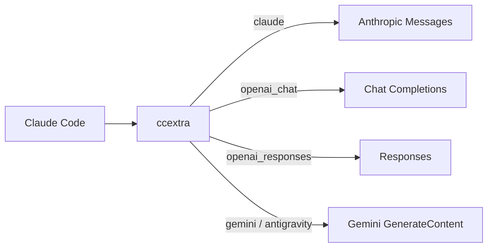

<div align="center">

# ccextra

<p align="center">
  <strong>在 Claude Code 中使用不同上游的模型。</strong><br>
  一个本地端口，统一接入 Claude、OpenAI、Gemini 与 OAuth 上游。
</p>

<p align="center">
  <a href="LICENSE"></a>
  <a href="Cargo.toml"></a>
  
</p>

<p align="center">
  <b>中文</b> • <a href="README.en.md">English</a>
</p>

<p align="center">
  <a href="#核心特性">核心特性</a> •
  <a href="#架构流向">架构流向</a> •
  <a href="#协议矩阵">协议矩阵</a> •
  <a href="#快速开始">快速开始</a> •
  <a href="#配置参考">配置参考</a> •
  <a href="docs/design.md">深入设计</a>
</p>

---

</div>

单进程 Rust 代理。Claude Code 发送 Anthropic Messages 请求，ccextra 按模型别名选择上游，完成协议转换，再返回 Anthropic 格式的 JSON 或 SSE 响应。

## 核心特性

- **按模型切换上游**：五种协议共用一个端口，模型别名与实际模型名分开配置。
- **请求内容稳定化**：归一化工具、schema 和历史内容，减少无意义的跨轮差异；实际缓存命中由上游决定。
- **模型能力适配**：转换消息、工具调用与图片，按 `models.json` 调整支持的 reasoning 档位。
- **OAuth 接入**：支持 Antigravity、xAI Grok 与 Codex（OpenAI ChatGPT 订阅）凭证加载、刷新和动态模型路由。
- **配置热重载**：无需重启即可发布新配置；进行中的请求继续使用原快照。

## 架构流向



一个进程监听一个端口。入站始终是 Anthropic 形状，出口统一还原为 Anthropic 响应（含 SSE）。详见[架构设计](docs/design.md)。

## 协议矩阵

| 协议标识 (`protocol`) | 上游目标形态 | 核心适配策略 |
| :--- | :--- | :--- |
| `claude` | Anthropic Messages | 替换目标模型；非 Claude 模型额外清洗 system、调整 effort。响应正文直通。 |
| `openai_chat` | Chat Completions | 转换消息、工具和图片；适配 Kimi K2.8 思考参数与温度约束。 |
| `openai_responses` | Responses | 转换 `instructions` 与 `input`；支持 reasoning replay 和搜索域过滤。 |
| `gemini` | Gemini GenerateContent | 转换内容块、工具结果和 schema。 |
| `antigravity` | Cloud Code Assist | 封装 Gemini 请求，处理工具命名和模型输出上限；默认短连接。 |

> **提示**：xAI Grok 与 Codex 均通过 OAuth 动态注册为 `openai_responses` provider，无需配置独立协议。Codex 订阅请求自动携带 `Chatgpt-Account-Id` 身份头，请求体自动 zstd 压缩（对齐 codex CLI 默认行为）。

## 快速开始

### 1. 编译

```bash
cargo build --release
```

### 2. 配置上游

复制 [配置模板](config.example.yaml) 后编辑，或将下面的最小示例保存为 `config.yaml`。替换 `base_url`、`key` 和 `models[].name`，模型名须由你的上游支持。

```yaml
server:
  host: "127.0.0.1"
  port: 8222

providers:
  - name: upstream
    protocol: openai_responses
    base_url: https://example.com/v1
    key: sk-xxx
    prompt_cache_key: true
    models:
      - name: your-upstream-model
        alias: coding

normalize:
  enabled: true
  drift_detector: true

logging:
  level: info
  request_body: false

secret_key: "replace-with-your-local-key"
```

OpenAI 协议的 `base_url` 包含版本前缀（如 `/v1`），不要再附加 `/responses` 或 `/chat/completions`；Claude 协议不包含 `/v1`。

### 3. 启动并连接

启动代理：

```bash
./target/release/ccextra --config config.yaml
```

另开终端，将认证值换成配置中的本地 key。它与上游 `providers[].key` 分开使用：

```bash
export ANTHROPIC_BASE_URL=http://127.0.0.1:8222
export ANTHROPIC_AUTH_TOKEN=replace-with-your-local-key
claude --model coding
```

首次加载会将 `secret_key` 转为 bcrypt 并写回配置；客户端仍使用原始明文 key。

检查服务和模型列表：

```bash
curl http://127.0.0.1:8222/health
curl -H "Authorization: Bearer $ANTHROPIC_AUTH_TOKEN" \
  http://127.0.0.1:8222/v1/models
```

需要后台运行时，使用 `build.sh` 和 `start.sh`、`stop.sh`、`restart.sh`。这些脚本使用根目录 `./ccextra`；`build.sh` 会更新该二进制。

## 配置参考

完整字段见 [config.example.yaml](config.example.yaml)。要点：

- `models[].alias` 是入站模型名，不能跨 provider 重复；`base_url` 可为按顺序回退的数组。
- `server.proxy_url` 可被 provider `proxy_url` 覆盖，`"direct"` 表示直连。
- `secret_key` 启用入口认证：明文 key 在加载时转为 bcrypt 并写回配置，请求接受 `x-api-key` 或 `Authorization: Bearer`。
- `payload` 按模型 glob 覆盖顶层参数，可用 `protocol` 限定。
- `prompt_cache_key` 只用于 OpenAI 路径，取 Claude Code 会话 ID，且不覆盖已有非空值。
- `models_file` 指向 reasoning 级别表（默认配置文件旁 `models.json`，不入 git，可从 [models.json.example](models.json.example) 复制后按需修改），按上游模型 `id` 精确匹配，把入站 effort 钳到该模型支持的最近档；缺文件或未收录的模型不钳。条目可加 `force_effort`：凡钳制会介入的 effort 一律改写为该固定值（不钳制），`*claude*` 原生模型与显式关闭思考的请求不受影响。

<details>
<summary>进阶选项</summary>

- `user_agents` 可覆盖 Claude、Codex、Grok、Antigravity 标识。
- `logging.request_body` 将诊断请求写入 `logs/`。
- `POST /reload` 校验后原子发布 providers、payload、归一化、认证、代理、User-Agent、reasoning 注册表及后台刷新参数；旧请求使用旧快照，新请求使用新快照。并发 reload 串行加载和发布，加载或校验失败不改变当前快照与版本；`logging.level` 需重启。
- 后台刷新使用最近成功发布的静态配置、凭证目录和代理，不读取未 reload 的配置文件变更。旧轮次结果丢弃；Antigravity 无可用结果时保留整个 provider 集合。显式 reload 优先应用删除、禁用和目录切换，不补回旧动态 provider；动态加载失败沿用跳过不可用凭证的行为。
- `antigravity.connection-pool` 控制 Antigravity 上游连接池：默认短连接，显式 `enabled: true` 后按 `idle-conn-timeout`（默认 30s，上限 210s）与 `max-idle-conns-per-host`（默认 2，上限 100）保留空闲连接。
- 改动 `models.json` 后 `POST /reload` 生效，不必重编译。

</details>

## API 端点

| 方法与端点 | 权限说明 | 功能描述 |
| :--- | :--- | :--- |
| `POST /v1/messages` | 需认证* | 接收 Anthropic Messages，返回 JSON 或 SSE。 |
| `POST /v1/messages/count_tokens` | 需认证* | Claude 转发上游计数；其他协议读取会话记录，未命中返回 0。 |
| `GET /v1/models` | 需认证* | 获取 Anthropic 格式的可用模型列表。 |
| `GET /health` | 公开 | 返回 `ok`，不检查上游是否可用。 |
| `POST /reload` | 公开 | 加载、校验并发布新配置，无需重启。 |

> `*` 注：当配置 `secret_key` 时，带 `*` 的端点须携带 `x-api-key` 或 `Authorization: Bearer` 鉴权。

## 运行机制

<details>
<summary>请求处理、重试与资源边界</summary>

请求经过入口认证、模型路由、归一化、协议转换和参数覆盖后发送上游。OpenAI 路径按配置注入 `prompt_cache_key`，Gemini 和 Antigravity 不运行 OpenAI 专用处理。

- **请求兼容**：OpenAI Chat/Responses 转换时删除工具 schema 中的 `required: null`，不改 `default` 等实例数据；Antigravity 将 system 开头的 Claude Agent SDK/Claude Code 身份句中和，保留后续指令。Claude 原生直通不受影响。
- **流式响应**：Claude 正文字节直通，其他协议转换为 Anthropic SSE；所有流式路径使用 10 秒 `: keepalive`。
- **重试**：网络错误和 5xx/52x 使用共享的 3 秒退避预算，并支持多 `base_url` 回退。该预算不是请求总超时，不截断正常生成。429 不重试（对齐 codex 传输层 `retry_429: false`），快速失败并把上游 `Retry-After` 头透传给客户端，由客户端按声明退避。
- **读取边界**：非流成功正文上限 16 MiB，错误正文最多保留 256 KiB，读取 idle 为 120 秒。成功正文超限返回 502、停顿返回 504；错误正文读取异常保留已知状态，再按统一错误规则映射。OAuth、project 和模型读取仍保留 30 秒总超时。
- **头透传**：Claude 保留允许透传的身份头，排除认证及连接管理等头；`anthropic-beta` 原样透传，缺失时不补。

</details>

## OAuth 与运维

按需登录上游，或查看已保存的凭证状态：

```bash
./ccextra antigravity-login
./ccextra antigravity-status
./ccextra xai-login
./ccextra xai-status
./ccextra codex-login
./ccextra codex-status
./scripts/check_antigravity_quota.sh
./scripts/check_grok_quota.sh
./scripts/check_codex_quota.sh
```

Antigravity 凭证默认在配置文件旁 `.cache/antigravity`，xAI 在 `.cache/xai`，Codex 在 `.cache/codex`。xAI 与 Codex 启动时自动发现；Antigravity 后台加载并每 3 小时刷新模型。Codex 登录使用 PKCE 浏览器授权（本地回调端口默认 1455，可用 `--callback-port` 覆盖），token 提前 24 小时刷新。

修改配置或需要立即重新加载凭证时：

```bash
curl -X POST http://127.0.0.1:8222/reload
```

加载或校验失败会保留原配置。刷新与删除规则见上方「进阶选项」。

## 开发与架构分层

```bash
# 运行完整测试套件
cargo test --workspace

# 严格 Clippy 静态检查
cargo clippy --workspace --all-targets -- -D warnings
```

清晰的三层解耦架构设计：
- `ccextra-cli`：CLI 入口、启动生命周期与配置装载。
- `ccextra-server`：HTTP 引擎、OAuth 流程、SSE 状态机与上游连接池。
- `ccextra-core`：纯粹无 IO 的业务逻辑内核（路由算法、归一化引擎、协议转换器与 Reasoning 表）。

详细设计说明请查阅 [架构设计 (design.md)](docs/design.md) 与 [领域术语表 (glossary.md)](docs/glossary.md)。

## 开源协议

本项目采用 [MIT 许可证](LICENSE)。
