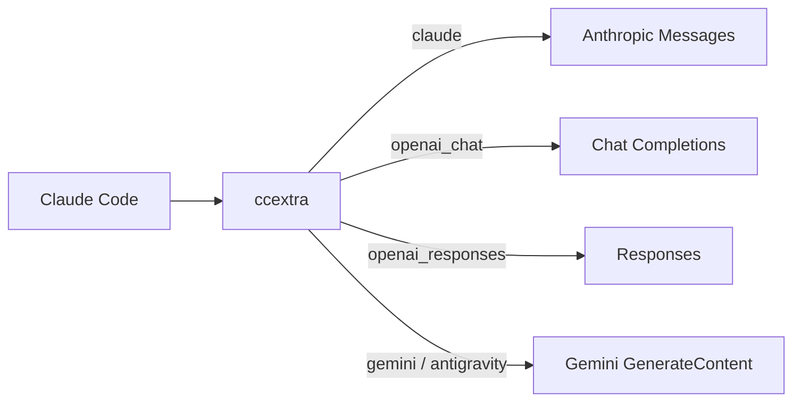

<div align="center">

# ccextra

<p align="center">
  <strong>The Intelligent Upstream Proxy for Claude Code.</strong><br>
  多协议智能路由 · 确定性缓存归一化 · 零损耗直通转发
</p>

<p align="center">
  <a href="LICENSE"></a>
  <a href="Cargo.toml"></a>
  
</p>

<p align="center">
  <b>中文</b> • <a href="README.en.md">English</a>
</p>

<p align="center">
  <a href="#核心特性">核心特性</a> •
  <a href="#架构流向">架构流向</a> •
  <a href="#协议矩阵">协议矩阵</a> •
  <a href="#快速开始">快速开始</a> •
  <a href="#配置参考">配置参考</a> •
  <a href="docs/design.md">深入设计</a>
</p>

---

</div>

单进程 Rust 高性能代理：将 Claude Code 的 Anthropic Messages 请求无缝路由、转换并转发至多模态上游。

## 核心特性

- **多协议统一中枢**：Claude、OpenAI Chat、OpenAI Responses、Gemini、Antigravity 聚合单端口，按模型 alias 智能分发。
- **透明直通与精准适配**：`claude` 仅换 `model`；非 Claude 模型自动剥离计费指纹与 Claude 触发段，按 `models.json` 钳制或锁定 (`force_effort`) 推理强度。
- **确定性缓存优化**：冻结 Schema/工具顺序、历史 reminder、参数键序与尾部空白，消减跨轮会话漂移，最大化上游 Prompt Cache 命中率。
- **动态凭证与生命周期**：xAI Grok OAuth 动态注入 Responses；Antigravity 凭证后台静默装载与定时轮换。
- **零停机热重载**：`POST /reload` 毫秒级替换 providers、payload 规则、认证、代理与 reasoning 表。

## 架构流向



一个进程监听一个端口。入站始终是 Anthropic 形状，出口统一还原为 Anthropic 响应（含 SSE）。详见[架构设计](docs/design.md)。

## 协议矩阵

| 协议标识 (`protocol`) | 上游目标形态 | 核心适配策略 |
| :--- | :--- | :--- |
| `claude` | Anthropic Messages | 极简透传：仅改 `model`；非 Claude 目标自动清洗 system 并钳制 effort。 |
| `openai_chat` | Chat Completions | 结构映射：转换 messages、工具与图片；适配 Kimi K2.8 思考规范与温度守卫。 |
| `openai_responses` | Responses | 深度适配：映射 `instructions` 与 `input`；支持 Reasoning Replay 与搜索域过滤。 |
| `gemini` | Gemini GenerateContent | 原生转换：对齐 Gemini 内容、结构化工具与 schema。 |
| `antigravity` | Cloud Code Assist | 企业信封：Gemini 格式封装运输信封；可选高性能连接池。 |

> **提示**：xAI Grok 通过 OAuth 动态注册为 `openai_responses` provider，无需配置独立协议。

## 快速上手

### 1. 编译与启动

```bash
# 1. 编译 release 二进制
cargo build --release

# 2. 复制配置模板并调整
cp config.example.yaml config.yaml

# 3. 启动代理服务
./target/release/ccextra --config config.yaml
```

### 2. 配置示例 (`config.yaml`)

```yaml
server:
  host: "127.0.0.1"
  port: 8222

providers:
  - name: upstream
    protocol: openai_responses
    base_url: https://example.com/v1
    key: sk-xxx
    prompt_cache_key: true
    models:
      - name: gpt-5.6-terra
        alias: gpt-5.6-terra

normalize:
  enabled: true
  drift_detector: true
```

### 3. 连接 Claude Code

在终端中设置环境变量即可无缝接管：

```bash
export ANTHROPIC_BASE_URL=http://127.0.0.1:8222
export ANTHROPIC_AUTH_TOKEN=sk-ccextra-xxx  # 配置 secret_key 时填写
```

> **后台守护**：使用 `build.sh` 快速构建，配合 `start.sh`、`stop.sh`、`restart.sh` 实现后台管理。

## 配置参考

完整字段见 [config.example.yaml](config.example.yaml)。要点：

- `models[].alias` 是入站模型名，不能跨 provider 重复；`base_url` 可为按顺序回退的数组。
- `server.proxy_url` 可被 provider `proxy_url` 覆盖，`"direct"` 表示直连。
- `secret_key` 启用入口认证：明文 key 在加载时转为 bcrypt 并写回配置，请求接受 `x-api-key` 或 `Authorization: Bearer`。
- `payload` 按模型 glob 覆盖顶层参数，可用 `protocol` 限定。
- `prompt_cache_key` 只用于 OpenAI 路径，取 Claude Code 会话 ID，且不覆盖已有非空值。
- `models_file` 指向 reasoning 级别表（默认配置文件旁 `models.json`，不入 git，可从 [models.json.example](models.json.example) 复制后按需修改），按上游模型 `id` 精确匹配，把入站 effort 钳到该模型支持的最近档；缺文件或未收录的模型不钳。条目可加 `force_effort`：凡钳制会介入的 effort 一律改写为该固定值（不钳制），`*claude*` 原生模型与显式关闭思考的请求不受影响。

<details>
<summary>进阶选项</summary>

- `user_agents` 可覆盖 Claude、Codex、Grok、Antigravity 标识。
- `logging.request_body` 将诊断请求写入 `logs/`。
- `POST /reload` 重载 providers、payload、归一化、认证、代理、User-Agent 和 reasoning 注册表；`logging.level` 需重启。
- `antigravity.connection-pool` 控制 Antigravity 上游连接池：默认短连接，显式 `enabled: true` 后按 `idle-conn-timeout`（默认 30s，上限 210s）与 `max-idle-conns-per-host`（默认 2，上限 100）保留空闲连接。
- 改动 `models.json` 后 `POST /reload` 生效，不必重编译。

</details>

## API 端点

| 方法与端点 | 权限说明 | 功能描述 |
| :--- | :--- | :--- |
| `POST /v1/messages` | 需认证* | 核心消息交互入口，完美对齐 Anthropic 协议与 SSE 流式返回。 |
| `POST /v1/messages/count_tokens` | 需认证* | 精确/会话估算 Token 计数（Claude 转发精确值，其他协议沿用上轮记录）。 |
| `GET /v1/models` | 需认证* | 获取 Anthropic 格式的可用模型列表。 |
| `GET /health` | 公开 | 节点探活接口，常驻返回 `ok`。 |
| `POST /reload` | 公开 | 零停机热重载，即刻生效最新配置、路由与 Reasoning 映射。 |

> `*` 注：当配置 `secret_key` 时，带 `*` 的端点须携带 `x-api-key` 或 `Authorization: Bearer` 鉴权。

## 运行机制

请求自入站起，依次执行：**入口认证 ➔ 智能路由 ➔ 缓存归一化 ➔ 目标协议转换 ➔ Payload 覆写 ➔ Prompt Cache Key 注入 ➔ 上游重试与分发**。

- **流式标准保障**：全流式路径输出标准 Anthropic SSE 事件流；内置 10 秒空闲保活机制（`: keepalive`）。
- **稳健重试退避**：遭遇网络抖动、429 或 5xx/52x 错误时，在 3 秒总预算内执行指数退避重试，自动顺延多 `base_url` 回退通道。
- **有界读取**：非流响应 body 限制为成功 16 MiB / 错误 256 KiB，读取停顿 300 秒。成功 body 超限返回 502、停顿返回 504；错误 body 截断或读取失败时保留上游状态码（429/401 不被改写）。
- **直通保真度**：Claude 协议完整保留客户端透传的身份头与 `anthropic-beta` 字段，杜绝非必要修改。

## OAuth 与运维

```bash
./ccextra antigravity-login
./ccextra antigravity-status
./ccextra xai-login
./ccextra xai-status
./scripts/check_antigravity_quota.sh
./scripts/check_grok_quota.sh
```

Antigravity 凭证默认在配置文件旁 `.cache/antigravity`，xAI 在 `.cache/xai`。xAI 启动时自动发现；Antigravity 后台加载并每 3 小时刷新模型。改完配置调用 `POST /reload` 生效。

## 开发与架构分层

```bash
# 运行完整测试套件
cargo test --workspace

# 严格 Clippy 静态检查
cargo clippy --workspace --all-targets -- -D warnings
```

清晰的三层解耦架构设计：
- `ccextra-cli`：CLI 入口、启动生命周期与配置装载。
- `ccextra-server`：HTTP 引擎、OAuth 流程、SSE 状态机与上游连接池。
- `ccextra-core`：纯粹无 IO 的业务逻辑内核（路由算法、归一化引擎、协议转换器与 Reasoning 表）。

详细设计说明请查阅 [架构设计 (design.md)](docs/design.md) 与 [领域术语表 (glossary.md)](docs/glossary.md)。

## 开源协议

本项目采用 [MIT 许可证](LICENSE)。
