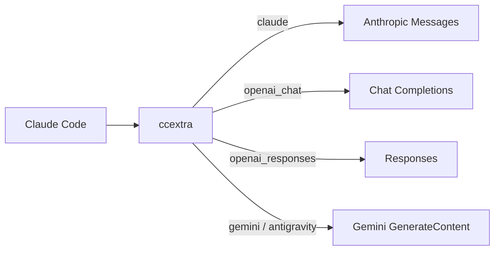

# ccextra

[](LICENSE)


**中文** | **[English](README.en.md)**

单进程 Rust 代理：把 Claude Code 的 Anthropic Messages 请求路由、转换并转发到多个上游。

## 特性

- **多协议上游**：Claude、OpenAI Chat、OpenAI Responses、Gemini、Antigravity 共用一个入口，按模型 alias 路由。
- **Claude 直通**：`claude` provider 只替换 `model`，其余请求内容保持原样。
- **确定性归一化**：稳定工具和 schema 顺序、历史 reminder、工具参数键序与尾部空白，减少跨轮序列化漂移，目标是提高上游 prompt cache 命中率。
- **动态 provider**：xAI Grok 经 OAuth 注入 Responses provider；Antigravity 凭证后台加载并定时刷新模型。
- **热重载**：`POST /reload` 替换 providers、payload、归一化、认证、代理、User-Agent 和 reasoning 注册表，无需重启。

## 架构



一个进程监听一个端口。入站始终是 Anthropic 形状，出口统一还原为 Anthropic 响应（含 SSE）。详见[架构设计](docs/design.md)。

## 支持的出站协议

| `protocol` | 上游接口 | 说明 |
| --- | --- | --- |
| `claude` | Anthropic Messages | 仅替换 `model`，其余请求内容保持原样。 |
| `openai_chat` | Chat Completions | 转换 messages、工具、图片和 reasoning（支持 Kimi K2.8）。 |
| `openai_responses` | Responses | 转换为 `instructions` 和 `input`，支持 reasoning replay 与 web_search 过滤。 |
| `gemini` | Gemini GenerateContent | 使用 Gemini 内容、工具和 schema 形状。 |
| `antigravity` | Cloud Code Assist | 使用 Gemini 形状并封装运输信封。 |

xAI Grok 经 OAuth 自动注入 `openai_responses` provider，不是独立 `protocol`。

## 快速开始

### 前置条件

- Rust 1.75 或更新版本
- 至少一个上游 provider 的地址和 key（OAuth provider 除外）

```bash
cargo build --release
cp config.example.yaml config.yaml
./target/release/ccextra --config config.yaml
```

### 配置示例

```yaml
server:
  host: "127.0.0.1"
  port: 8222
providers:
  - name: upstream
    protocol: openai_responses
    base_url: https://example.com/v1
    key: sk-xxx
    prompt_cache_key: true
    models:
      - name: gpt-5.6-terra
        alias: gpt-5.6-terra
normalize:
  enabled: true
  drift_detector: true
```

### 接入 Claude Code

```bash
export ANTHROPIC_BASE_URL=http://127.0.0.1:8222
export ANTHROPIC_AUTH_TOKEN=sk-ccextra-xxx # 配置 secret_key 时需要
```

后台运行：`build.sh` 构建 release 并更新根目录 `./ccextra`，`start.sh`、`stop.sh`、`restart.sh` 管理进程。

## 配置

完整字段见 [config.example.yaml](config.example.yaml)。要点：

- `models[].alias` 是入站模型名，不能跨 provider 重复；`base_url` 可为按顺序回退的数组。
- `server.proxy_url` 可被 provider `proxy_url` 覆盖，`"direct"` 表示直连。
- `secret_key` 启用入口认证：明文 key 在加载时转为 bcrypt 并写回配置，请求接受 `x-api-key` 或 `Authorization: Bearer`。
- `payload` 按模型 glob 覆盖顶层参数，可用 `protocol` 限定。
- `prompt_cache_key` 只用于 OpenAI 路径，取 Claude Code 会话 ID，且不覆盖已有非空值。
- `models_file` 指向 reasoning 级别表（默认配置文件旁 [models.json](models.json)），按上游模型 `id` 精确匹配，把入站 effort 钳到该模型支持的最近档；缺文件或未收录的模型不钳。

<details>
<summary>进阶选项</summary>

- `user_agents` 可覆盖 Claude、Codex、Grok、Antigravity 标识。
- `logging.request_body` 将诊断请求写入 `logs/`。
- `POST /reload` 重载 providers、payload、归一化、认证、代理、User-Agent 和 reasoning 注册表；`logging.level` 需重启。
- `antigravity.connection-pool` 控制 Antigravity 上游连接池：默认短连接，显式 `enabled: true` 后按 `idle-conn-timeout`（默认 30s，上限 210s）与 `max-idle-conns-per-host`（默认 2，上限 100）保留空闲连接。
- 改动 `models.json` 后 `POST /reload` 生效，不必重编译。

</details>

## 端点

| 端点 | 用途 |
| --- | --- |
| `POST /v1/messages` | 主请求入口。 |
| `POST /v1/messages/count_tokens` | Claude 上游转发精确计数；其他协议返回该会话上轮响应记录的输入 token 数，未命中返回 0。 |
| `GET /v1/models` | Anthropic 形状模型列表。 |
| `GET /health` | 返回 `ok`。 |
| `POST /reload` | 热重载配置。 |

配置 `secret_key` 后，前三个 Anthropic 端点需要认证。

## 运行行为

请求依次经过认证、路由、归一化、协议转换、payload 覆盖、缓存 key 注入和上游发送。Claude 直通保留入站身份头，`anthropic-beta` 原样透传、缺失时不补。所有流式出口以 Anthropic SSE 返回，空闲 10 秒发送 `: keepalive`。

网络错误、429 和 5xx 在 3 秒总预算内指数退避重试，并受限地尊重 `Retry-After`；多 `base_url` 按顺序尝试。

## OAuth 与运维

```bash
./ccextra antigravity-login
./ccextra antigravity-status
./ccextra xai-login
./ccextra xai-status
./scripts/check_antigravity_quota.sh
./scripts/check_grok_quota.sh
```

Antigravity 凭证默认在配置文件旁 `.cache/antigravity`，xAI 在 `.cache/xai`。xAI 启动时自动发现；Antigravity 后台加载并每 3 小时刷新模型。改完配置调用 `POST /reload` 生效。

## 开发

```bash
cargo test --workspace
cargo clippy --workspace --all-targets -- -D warnings
```

三个 crate：`ccextra-cli` 负责配置、CLI 和启动，`ccextra-server` 负责 HTTP、上游请求和 SSE，`ccextra-core` 存放路由、归一化和转换等纯逻辑。详见[架构设计](docs/design.md)和[术语表](docs/glossary.md)。

## License

[MIT](LICENSE)
